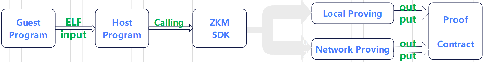

# ZKM Project Template

This is a template for creating an end-to-end ZKM project which can generate the EVM-Compatible proof and the on chain verification contract.

There are two ways to prove the guest program:

- Use your local machine
- Use ZKM proof network

## Running diagram



## Template code structure

> [!NOTE]
> The SDK has a libary(libsnark) which supports local proving. If the libsnark is required, please specify the features = ["snark"] in your Cargo.toml. To disable libsnark, set the environment variable NO_USE_SNARK to true when compiling the SDK.

```
├── Cargo.toml
├── LICENSE
├── Makefile
├── README.md
├── assets
│   └── temp-run-diagram.png
├── clippy.toml
├── contracts                   //Use Foundry to manage the verifier contract
│   ├── README.md
│   ├── foundry.toml
│   //...
├── guest-program               //Include Go and Rust examples
│   ├── README.md
│   ├── mem-alloc-vec
│   ├── sha2-go
│   └── sha2-rust
│  
├── host-program                //Generate the proof and verifier contracts  to the  guest programs
│   ├── Cargo.toml
│   ├── run-local-proving.sh
│   ├── run-network-proving.sh
│   ├── src
│      └── bin
│          └── zkm-prove.rs

├── install_mips_rust_tool
├── rust-toolchain.toml
├── sdk                         //Support proof network and local proof
    ├── Cargo.toml
    ├── build.rs
    └── src
       ├── lib.rs
       ├── local                //Generate the proof locally using the libsnark library.
       ├── network              //Generate the proof using ZKM Proof Network.
       ├── proto
       │   └── stage.proto
       └── prover.rs            //interface
```

## Local Proving Requirements

- Hardware: X86_64 CPU, 32 cores, 13GB memory (minimum)
- OS: Linux
- Rust: 1.81.0-nightly
- Go : 1.22.1
- Set up a local node for some blockchain(eg, sepolia)

## Network Proving Requirements

- Hardware: X86_64 CPU, 8 cores, 8G memory
- OS: Linux
- Rust: 1.81.0-nightly
- Go : 1.22.1
- CA certificate: ca.pem, ca.key
- [Register](https://www.zkm.io/apply) your address to use
- RPC for a blockchain (eg, sepolia)

> [!NOTE]
> All actions are assumed to be from the base directory `zkm-project-template`

## Running the project

### 0. Download the repo

```sh
git clone https://github.com/zkMIPS/zkm-project-template.git
```

### 1. Build the guest program ELF

Please refer to [this](guest-program/README.md) guide.

### 2. Build the host program

```sh
cd zkm-project-template
sdk/src/local/libsnark/compile.sh  # compile snark library
cargo build --release              # build host programs
```

If successfully, it will generate one binary files in `target/release`/{`sha2-rust` ,`sha2-go` ,`revme`, `mem-alloc-vec`}

> [!NOTE]
> You can run the guest program without generating a proof by setting the environmental variable `EXECUTE_ONLY` to "true".https://github.com/zkMIPS/zkm/issues/152

### 3. Generate groth16 proof and verifier contract

> [!NOTE]
> 1. The host program executes local proving when the environmental variable `ZKM_PROVER` is set to "local" and performs network proving when `ZKM_PROVER` is set to "network"

> 2. There is  a script program available: run_proving.sh. The script facilitate the generation of proofs on the local machine and over the proof network.

> 3. There are four guest programs(sha2-rust, sha2-go, mem-alloc-vec,revme). The following will use sha2-rust and revme as an example to demonstrate local and network proofs.

> 4. If the environmental variable `PROOF_RESULTS_PATH` is not set, the proof results file will be saved in zkm-project-template/contracts/{src, verifier}; if the environmental variable `PROOF_RESULTS_PATH` is set, after the proof is completed, the proof results file needs to be copied from from 'PROOF_RESULTS_PATH'/{src, verifier} to the corresponding zkm-project-template/contracts/{src, verifier}.


> [!WARNING]
>  The environmental variable `SEG_SIZE` in the run-xxx_proving.sh affects the final proof generation. 

>  The guest program's ELF with the input is split into segments according the SEG_SIZE, based on the cycle count.

>  When generating proofs on the local machine, if the log shows "!!!*******seg_num: 1", please reduce SEG_SIZE or increase the input. If generating proofs through the proof network, SEG_SIZE must be within the range [65536, 262144]. 

### Example 1 : `sha2-rust`

This host program sends the private input pri_input = vec![5u8; 1024] and its hash (hash(pri_input)) to the guest program for verification of the hash value.

#### Local Proving

Make any edits to [`run-proving.sh`](host-program/sha2-rust/run-proving.sh) and run the program:


```sh
cd zkm-project-template/host-program/sha2-rust
./run-proving.sh local
```

If successful, it will output a similar log:

##### **`sha2-rust-local-proving.log`**

```
[2024-11-23T13:12:33Z INFO  sha2_rust] new prover client,ok.
[2024-11-23T13:12:33Z INFO  zkm_sdk] excuting the setup.
[2024-11-23T13:12:33Z INFO  zkm_emulator::utils] Split done 66446 : 89443
[2024-11-23T13:21:05Z INFO  zkm_sdk::local::stark] !!!*******seg_num:2
[2024-11-23T13:21:55Z INFO  zkm_sdk::local::util] Process segment /mnt/data/gavin/zkm-project-template/host-program/sha2-rust/../test-vectors/input/segments/0
[2024-11-23T13:21:59Z INFO  zkm_prover::cpu::bootstrap_kernel] Bootstrapping took 3228 cycles
[2024-11-23T13:21:59Z INFO  zkm_prover::generation] CPU halted after 64762 cycles
[2024-11-23T13:21:59Z INFO  zkm_prover::generation] CPU trace padded to 65536 cycles
[2024-11-23T13:21:59Z INFO  zkm_prover::generation] Trace lengths (before padding): TraceCheckpoint { arithmetic_len: 18057, cpu_len: 65536, poseidon_len: 3227, poseidon_sponge_len: 3227, logic_len: 15372, memory_len: 390244 }
[2024-11-23T13:22:14Z INFO  plonky2::util::timing] 19.1346s to prove root first
[2024-11-23T13:22:15Z INFO  zkm_sdk::local::util] Process segment /mnt/data/gavin/zkm-project-template/host-program/sha2-rust/../test-vectors/input/segments/1
[2024-11-23T13:22:18Z INFO  zkm_prover::cpu::bootstrap_kernel] Bootstrapping took 2583 cycles
[2024-11-23T13:22:18Z INFO  zkm_prover::generation] CPU halted after 7530 cycles
[2024-11-23T13:22:18Z INFO  zkm_prover::generation] CPU trace padded to 8192 cycles
[2024-11-23T13:22:18Z INFO  zkm_prover::generation] Trace lengths (before padding): TraceCheckpoint { arithmetic_len: 1511, cpu_len: 8192, poseidon_len: 2582, poseidon_sponge_len: 2582, logic_len: 1157, memory_len: 123358 }
[2024-11-23T13:22:29Z INFO  plonky2::util::timing] 14.4273s to prove root second
[2024-11-23T13:22:30Z INFO  plonky2::util::timing] 1.3184s to prove aggression
[2024-11-23T13:22:32Z INFO  zkm_sdk::local::util] proof size: 413003
[2024-11-23T13:22:38Z INFO  zkm_sdk::local::util] build finish
[2024-11-23T13:22:45Z INFO  plonky2x::backend::wrapper::wrap] Succesfully wrote common circuit data to common_circuit_data.json
[2024-11-23T13:22:45Z INFO  plonky2x::backend::wrapper::wrap] Succesfully wrote verifier data to verifier_only_circuit_data.json
[2024-11-23T13:22:45Z INFO  plonky2x::backend::wrapper::wrap] Succesfully wrote proof to proof_with_public_inputs.json
[2024-11-23T13:22:45Z INFO  plonky2::util::timing] 99.1857s to prove total time
Generating witness 2024-11-23 13:24:17.684495304 +0000 UTC m=+703.805549132
frontend.NewWitness cost time: 143 ms
Creating proof 2024-11-23 13:24:17.828400392 +0000 UTC m=+703.949454200
13:24:23 DBG constraint system solver done nbConstraints=5815132 took=5606.081295
13:24:30 DBG prover done acceleration=none backend=groth16 curve=bn254 nbConstraints=5815132 took=7527.912415
groth16.Prove cost time: 13134 ms
Verifying proof 2024-11-23 13:24:30.962722326 +0000 UTC m=+717.083776144
13:24:30 DBG verifier done backend=groth16 curve=bn254 took=1.441281
groth16.Verify cost time: 1 ms
before len of publicWitness:1
after len of publicWitness:2
13:24:30 DBG verifier done backend=groth16 curve=bn254 took=1.288129
[2024-11-23T13:24:30Z INFO  sha2_rust] Proof: successfully written 1268 bytes.
[2024-11-23T13:24:30Z INFO  sha2_rust]  hash(bincode(pulic_input))1: [197, 85, 237, 192, 203, 240, 69, 67, 7, 62, 23, 5, 10, 112, 210, 80, 40, 245, 196, 9, 255, 152, 190, 127, 32, 148, 73, 249, 212, 64, 168, 103]
[2024-11-23T13:24:30Z INFO  sha2_rust] Contract: successfully written 12961 bytes.
[2024-11-23T13:24:30Z INFO  sha2_rust] Generating proof successfully .The proof file and verifier contract are in the the path /mnt/data/gavin/zkm-project-template/host-program/sha2-rust/../../contracts/{verifier,src} .
[2024-11-23T13:24:30Z INFO  sha2_rust] Elapsed time: 205 secs
```

The result proof and contract file will be in the contracts/verifier and contracts/src respectively.

#### Network Proving

> [!NOTE]
> The proving network may sometimes experience high traffic, causing proof tasks to be queued for hours.

> The proving task requires several stages: queuing, splitting, proving, aggregating and finalizing. Each stage involves a varying duration.

Must set the `PRIVATE_KEY` in [`run-proving.sh`](host-program/sha2-rust/run-proving.sh) and run the program:

```sh
./run-proving.sh network
```

If successful, it will output a similar log:

##### **`sha2-rust-network-proving.log`**

```
[2024-11-23T10:13:04Z INFO  sha2_rust] new prover client.
[2024-11-23T10:13:05Z INFO  sha2_rust] new prover client,ok.
[2024-11-23T10:13:05Z INFO  zkm_sdk::network::prover] calling request_proof.
[2024-11-23T10:13:08Z INFO  zkm_sdk::network::prover] calling wait_proof, proof_id=31134979-8e99-4de6-988c-46211df28c80
[2024-11-23T10:13:08Z INFO  zkm_sdk::network::prover] generate_proof : proving the task.
[2024-11-23T10:13:38Z INFO  zkm_sdk::network::prover] generate_proof : finalizing the proof.
[2024-11-23T10:14:11Z INFO  sha2_rust] Proof: successfully written 1263 bytes.
[2024-11-23T10:14:11Z INFO  sha2_rust]  hash(bincode(pulic_input))1: [197, 85, 237, 192, 203, 240, 69, 67, 7, 62, 23, 5, 10, 112, 210, 80, 40, 245, 196, 9, 255, 152, 190, 127, 32, 148, 73, 249, 212, 64, 168, 103]
[2024-11-23T10:14:11Z INFO  sha2_rust] Contract: successfully written 12960 bytes.
[2024-11-23T10:14:11Z INFO  sha2_rust] Generating proof successfully .The proof file and verifier contract are in the the path /mnt/data/gavin/zkm-project-template/host-program/sha2-rust/../../contracts/{verifier,src} .
[2024-11-23T10:14:11Z INFO  sha2_rust] Elapsed time: 66 secs
```

The result proof and contract file will be in the contracts/verifier and contracts/src.

### 4. Deploy the Verifier Contract

If your system does not has Foundry, please install it:

```sh
curl -L https://foundry.paradigm.xyz | bash
```
#### Verify the snark proof generateing in the step 3

```
cd  zkm-project-template/contracts
forge test
```

If successful, it will output a similar log:

```
[⠊] Compiling...
No files changed, compilation skipped

Ran 2 tests for test/verifier.t.sol:VerifierTest
[PASS] test_ValidProof() (gas: 287072)
[PASS] test_ValidPublicInputs() (gas: 67184)
Suite result: ok. 2 passed; 0 failed; 0 skipped; finished in 8.51ms (8.64ms CPU time)

Ran 1 test suite in 9.28ms (8.51ms CPU time): 2 tests passed, 0 failed, 0 skipped (2 total tests)
```

#### Deploy the contract generateing in the step 3

Please edit the following parameters according your aim blockchain.

```
forge script script/verifier.s.sol:VerifierScript --rpc-url https://eth-sepolia.g.alchemy.com/v2/RH793ZL_pQkZb7KttcWcTlOjPrN0BjOW --private-key df4bc5647fdb9600ceb4943d4adff3749956a8512e5707716357b13d5ee687d9
```

If successful, it will output a similar log:

```
[⠊] Compiling...
[⠘] Compiling 2 files with Solc 0.8.26
[⠊] Solc 0.8.26 finished in 699.26ms
Compiler run successful!
Script ran successfully.

## Setting up 1 EVM.

==========================

Chain 11155111

Estimated gas price: 0.000035894 gwei

Estimated total gas used for script: 1228147

Estimated amount required: 0.000000044083108418 ETH

==========================

SIMULATION COMPLETE. To broadcast these transactions, add --broadcast and wallet configuration(s) to the previous command. See forge script --help for more.

Transactions saved to: /mnt/data/zkm-project-template/contracts/broadcast/verifier.s.sol/11155111/dry-run/run-latest.json

Sensitive values saved to: /mnt/data/zkm-project-template/contracts/cache/verifier.s.sol/11155111/dry-run/run-latest.json
```

For more details, please refer to [this](contracts/README.md) guide.

### Example 2 : `revme`

The revme guest program takes a block data as input and its running is as same as the sha2-rust. Here, the focus is on explaining how to generate block data(the revme's input).

#### Generating the public input about a specific block

> [!NOTE]
> The local node connects  ZKM test chain in the following example. You must use the Eth-Compatible local node.

```sh
cd ~
git clone https://github.com/zkMIPS/revme
cd revme
RPC_URL=http://localhost:8545 CHAIN_ID=1337 BLOCK_NO=244 RUST_LOG=debug SUITE_JSON_PATH=./test-vectors/244.json cargo run --example process
```

If successfully, it will generate `244.json` in the path test-vectors

```sh
cp test-vectors/244.json zkm-project-template/host-program/test-vectors/
```

Next, you need to edit the `JSON_PATH` variable in the [`run-proving.sh`](host-program/revme/run-proving.sh) to match the name of the  JSON file mentioned above.

Then, you can execute the run-proving.sh by following the steps outlined in `Example 1: sha2-rust`.